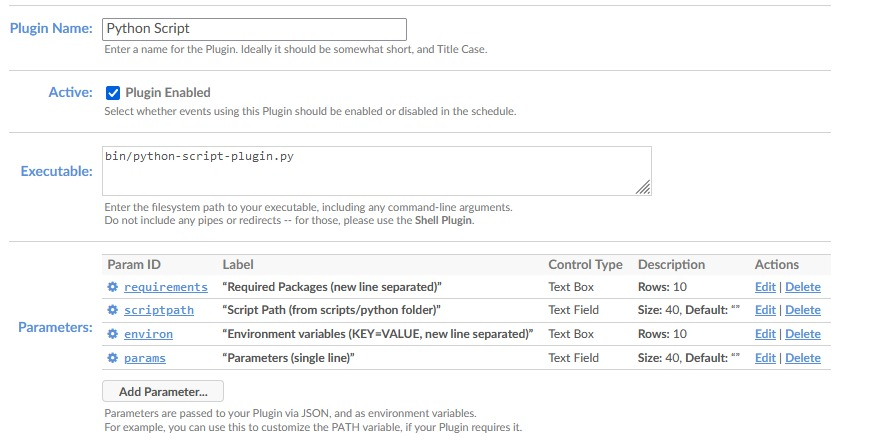

# docker-cronicle-python

Docker project for Cronicle, bundling a python environment and script runner.

## Instalation

### 1. Prepare working dir

* Execute: `make prepare`

This command creates the folder `.cronicle` within your home directory.

### 2. Build the image

* Execute: `make build`

This commands builds the docker image from this repo.

### 3. Run container

* Execute: `make run`

This commands creates and runs a docker container with the image created above. It exposes the console at port `3012` and mounts the directory `$HOME/.cronicle` as the base for cronicle file system.

### 4. Access the Cronicle UI and configure the Python plugin

* Open [Cronicle console](localhost:3012)
* Go to `Admin > Plugins > [+] Add new plugin...`
* Create the plugin as:
  * Plugin name: `Python Script`
  * Executable: `bin/python-script-plugin.py`
  * Parameters:
    * ID: `requirements`, Control Type: `TextBox` (Rows: 10), Label: `Required Packages (new line separated)`
    * ID: `scriptpath`, Control Type: `TextField` (Size: 40), Label: `Script Path (from scripts/python folder)`
    * ID: `environ`, Control Type: `TextBox` (Rows: 10), Label: `Environment variables (KEY=VALUE, new line separated)`
    * ID: `params`, Control Type: `TextField` (Size: 40), Label: `Parameters (single line)`

## Adding a new Python script to run

* Copy your python script to `$HOME/.cronicle/scripts/python`
* Open [Cronicle console](localhost:3012)
* Go to `Schedule > [+] Add event...`
* Create the job as:
  * Plugin: `Python Script` created previously.
  * Required packages (not required): the same text of your `requirements.txt` file, each package in a line, with versions if needed.
  * Script path: the path to your script file, relative to `scripts/python` (i.e. `my_script.py` for `$HOME/.cronicle/scripts/python/my_script.py`).
  * Environment variables (not required): environment variables, one per line, in the format of a .env file (i.e. `AWS_REGION=us-east-1`)
  * Parameters (not required): whole string of script parameters (i.e. `--v -f file.txt`)
  * All other configurations, please refer to [cronicle official docs](https://github.com/jhuckaby/Cronicle/blob/master/docs/WebUI.md) to learn how to configure

## Acknowledgments

Thanks `soulteary` for making Cronicle available for Docker.

## Authors

* **[flavsdotpy](github.com/flavsdotpy)**
